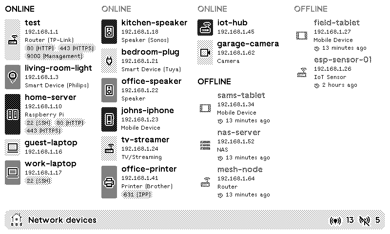

# Network Devices Plugin for TRMNL

Monitor all devices on your local network directly on your TRMNL display.

## Setup

### 1. Get Your Plugin UUID from TRMNL

1. Create a Private Plugin in TRMNL
2. Choose "Webhook" as data source
3. Copy your Plugin UUID from the webhook URL

### 2. Install on Your Raspberry Pi/Server

```bash
git clone https://github.com/ExcuseMi/trmnl-network-devices-plugin.git
cd trmnl-network-devices-plugin
cp .env.example .env
nano .env  # Add your PLUGIN_UUID
docker-compose up -d
```

That's it. The scanner will auto-detect your network and start sending data to TRMNL.

### Scanner Settings (.env file)

```bash
PLUGIN_UUID=your_plugin_uuid_here
INTERVAL=15        # Scan every 15 minutes
BYTE_LIMIT=2000    # 2000 for free, 5000 for TRMNL+
# Network to scan in CIDR notation (auto-detected if empty)
# Example: 192.168.1.0/24
NETWORK=192.168.1.0/24
# How long to keep offline devices in minutes (default: 1440 = 24 hours)
# Devices last seen longer than this will be removed from display
# These offline devices will still be sent to the TRMNL plugin until the OFFLINE RETENTION is reached.
# Examples: 60 (1 hour), 180 (3 hours), 720 (12 hours), 1440 (24 hours)
OFFLINE_RETENTION=1440
# Enable port scanning (default: false)
# Set to true, 1, or yes to enable
ENABLE_PORT_SCAN=false
# Ports to scan (comma-separated list or ranges, default: common ports)
# Default: 22,80,443,8080,3389,5900,9000
# Common ports explained:
#   22    - SSH
#   80    - HTTP
#   443   - HTTPS
#   8080  - HTTP alternate
#   3389  - RDP (Remote Desktop)
#   5900  - VNC
#   9000  - Various services
#
# Examples:
#   PORT_SCAN_PORTS=22,80,443,8080,3389,5900,9000  (default common ports)
#   PORT_SCAN_PORTS=20-25,80,443,3389,8000-8100     (ranges supported)
#   PORT_SCAN_PORTS=all                             (scan all 65535 ports - VERY SLOW!)
PORT_SCAN_PORTS=22,80,443,8080,3389,5900,9000
```
                                
## Updating

```bash
cd trmnl-network-devices-plugin
git pull
docker-compose down
docker-compose build --no-cache
docker-compose up -d
```

After updating, review .env.example and compare it with your existing .env file. Add or adjust any new configuration options as needed.

## How It Works

The network scanner uses two complementary methods to discover devices:

1. **ARP Scan** - Fast layer-2 discovery that finds devices on your local subnet by sending ARP requests
2. **Nmap Scan** - Layer-3 ping scan that can find devices that don't respond to ARP

Once devices are found, the scanner:
- Resolves hostnames using DNS, mDNS (Avahi), and NetBIOS
- Looks up vendor information from MAC addresses using the Wireshark OUI database
- Detects device types based on hostname patterns and vendor names
- Tracks online/offline status by comparing timestamps between scans

## Troubleshooting

### Why a Device Might Not Show Up

#### 1. Device is not on the same subnet
- **Cause:** The scanner only finds devices on the same network segment
- **Check:** Is the device on a different VLAN, guest network, or subnet?
- **Solution:** Run the scanner on each network segment, or adjust your `NETWORK` environment variable

#### 2. Device has network isolation enabled
- **Cause:** Some IoT devices, guest networks, or AP isolation features prevent device discovery
- **Check:** Can you ping the device from the scanner host? `ping 192.168.1.x`
- **Solution:** Disable AP/client isolation in your router settings

#### 3. Device doesn't respond to ARP or ping
- **Cause:** Some devices intentionally hide from network scans (stealth mode), or firewalls block ICMP/ARP
- **Check:** Try scanning manually:
  ```bash
  docker exec network-scanner arp-scan --interface=eth0 --localnet
  docker exec network-scanner nmap -sn 192.168.1.0/24
  ```
- **Sadly,  These devices can't be auto-discovered **
#### 4. Scanner container networking issues
- **Cause:** Container must run in `host` network mode to see local devices, and needs `privileged: true` for raw socket access
- **Check:** Verify docker-compose.yml has both settings:
  ```bash
  docker inspect network-scanner | grep -A5 NetworkMode
  docker inspect network-scanner | grep Privileged
  ```
- **Solution:** Ensure your docker-compose.yml contains:
  ```yaml
  network_mode: host
  privileged: true
  ```

#### 5. Hostname resolution fails
- **Cause:** Devices show as IP addresses instead of friendly names (common with mobile devices using MAC randomization)
- **Check:** Does the device have a hostname configured? Does it broadcast via mDNS?
- **Solution:** Use Device Configuration in TRMNL plugin settings to set custom names

#### 6. Device is filtered or rate-limited
- **Cause:** Router/firewall may rate-limit or block scanning activity
- **Check:** Look for "host unreachable" or timeout errors in logs
- **Solution:** Increase `INTERVAL` between scans, or whitelist the scanner in your firewall
## License

MIT

<!-- PLUGIN_STATS_START -->
## 🚀 TRMNL Plugin(s)

*Last updated: 2025-12-24 06:15:29 UTC*


##  [Network Devices v1.1](https://usetrmnl.com/recipes/189338)



### Description
Keep tabs on every device connected to your home or office network with automatic discovery, smart categorization, and real-time status tracking. Network Devices scans your local network, identifies devices by vendor and type, and displays them with intuitive icons on your TRMNL.<br /><br />Features:<br />• Automatic device detection via arp-scan and nmap<br />• Smart vendor identification from MAC addresses<br />• Offline tracking - see when devices disconnect<br />• Port scanning with customizable labels<br />• Customizable names, icons, and device types<br />• Clean, modern interface with Material Symbols icons<br /><br />Requires a Docker container running on your network (5 min setup). Perfect for monitoring IoT devices, tracking network usage, or keeping an eye on who's connected.<br /><br /><strong>Changelog:</strong><br />• <strong>v1.1:</strong> <strong>Added port scanning.</strong><br />Update your network-scanner and enable the .env properties (see the updated .env.axample )<br />

### 📊 Statistics

| Metric | Value |
|--------|-------|
| Installs | 1 |
| Forks | 21 |

---

<!-- PLUGIN_STATS_END -->
## Credits

- Uses [Wireshark OUI Database](https://www.wireshark.org/) for vendor identification
